# Active-Region Segmentation

**Teaching a foundation model to outline the Sun's magnetically busy patches — and working out when it is good enough.**

Brian Thomas · Jack Ireland · C. Alex Young
2nd Surya Workshop · NASA Goddard · 18 September 2026

> This is the companion document to the 14-slide talk
> (`ar_segmentation_magnetogram.html` / `.pdf` / `.pptx`). It assumes no machine-learning
> background beyond the idea that a model is trained on examples. Every term is defined
> where it first appears.

---

## 1. The task

The Sun has patches where the magnetic field is strong and tangled — **active regions**.
They are where flares come from, so knowing where they are, and how big they are, matters.

NASA's Solar Dynamics Observatory photographs the whole solar disk every 12 minutes. We
want a computer to mark, pixel by pixel, which parts of a picture are active region and
which are ordinary Sun.

| stage | what it is |
|---|---|
| **In** | 13 pictures of the whole Sun, taken at the same moment (8 ultraviolet wavelengths + 5 magnetic components) |
| **Model** | **Surya**, a 366-million-parameter model already trained on years of solar images, with a small new head bolted on |
| **Out** | one number per pixel: how sure it is that this pixel sits inside an active region |

We only train the small head and a thin set of adapters — about 3 million numbers out of
366 million. The rest of Surya stays frozen. That is what makes this affordable.

The **answer key** — the outlines we score against — comes from the ARPIL task of
SuryaBench (Roy *et al.*, *Scientific Data* **13**, 712, 2026).

---

## 2. How we score it: IoU

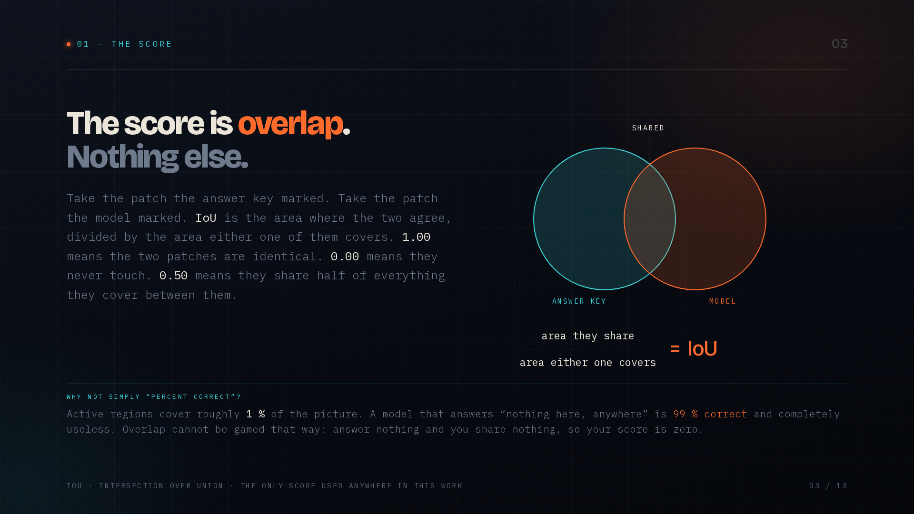

Take the patch the answer key marked. Take the patch the model marked. **IoU**
(*intersection over union*) is the area where the two agree, divided by the area either one
of them covers.

```
              area they share
   IoU  =  ───────────────────────
           area either one covers
```

- **1.00** — the two patches are identical.
- **0.00** — they never touch.
- **0.50** — they share half of everything they cover between them.

### Why not simply "percent correct"?

Active regions cover roughly **1 %** of the picture. A model that answers *"nothing here,
anywhere"* is **99 % correct** and completely useless.

Overlap cannot be gamed that way: answer nothing and you share nothing, so your score is
zero. Every number in this document is an overlap score. None of them is an accuracy.

---

## 3. Four words that turn up on every training run

| word | what it means |
|---|---|
| **Epoch** (a *pass*) | One pass over every training picture. Training is many epochs. After each one we test on pictures the model has never seen, and write down the score. |
| **Loss** | One number saying how wrong the answers are. Training only ever pushes this down. Lower is better — but only if it is measuring the thing you actually care about. |
| **Precision** | Of the pixels the model called active region, what fraction really were? This is the one that punishes crying wolf. |
| **Recall** | Of the pixels that really were active region, what fraction did the model find? This is the one that punishes missing things. |

Precision and recall pull in opposite directions. Call everything active and recall is
perfect while precision collapses; call almost nothing and the reverse. **They only mean
anything read as a pair** — which is exactly what the next section is about.

---

## 4. The first run: the loss improved, the model learned to predict nothing

Eight pictures, two passes. A textbook failure.

| pass | loss | precision | recall |
|---|---|---|---|
| 0 | 0.021 | 0.71 | 0.0054 |
| 1 | 0.013 ↓ | 1.00 | **0.000035** |

|  | 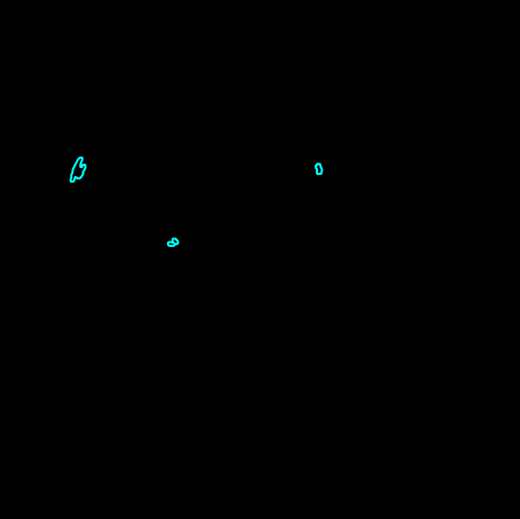 |
|:--:|:--:|
| **What the model said** — no pixel called active region | **What was actually there** — the same moment, with the key drawn on |

The number training watches went **down**, which normally means better. The answers went to
nothing at all.

Recall fell to 0.000035: of every 100,000 active-region pixels, the model found three.
Precision rose to a perfect 1.00 — on the handful of pixels it still dared to call. The
model had discovered that saying *nothing, anywhere* is a cheap way to be wrong less often.

**Watch the pair. Never the loss alone.**

---

## 5. Three causes — all of them the setup, none of them the model

| # | cause | fix |
|---|---|---|
| 1 | **We picked the dullest days.** A lazy date filter grabbed mid-January 2011, near solar minimum: 987 blank pixels for every active one. | Train on 2013–2015, when the Sun was busy. |
| 2 | **Rare things didn't count.** Ignoring the 1 % of pixels that mattered was nearly free — it cost 0.24. | Make rare pixels count in proportion to their rarity. The same lazy answer now costs 8.4. |
| 3 | **Learning too fast.** The learning rate — how big a correction the model makes each step — was ten times too high. | Big steps overshoot and the model bails out to the safest answer. Rate chosen per model. |

None of the three was the model's fault. All three were choices we made around it — and all
three are the sort of thing that is easy to get wrong the first time.

---

## 6. What it looks like when it works

Same code, same model, the setup fixed, 60 training pictures. Four views of a single moment:

| | |
|:--:|:--:|
| 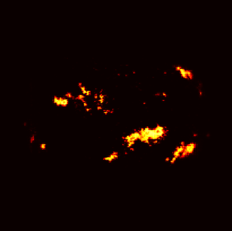 | 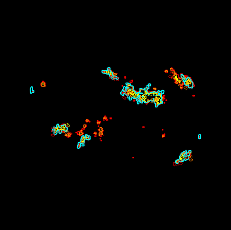 |
| **How sure it is** — brighter = more confident this is active region | **Where it draws the line** — at 25 %, 50 % and 75 % sure; cyan = truth |
| 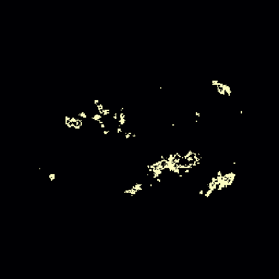 | 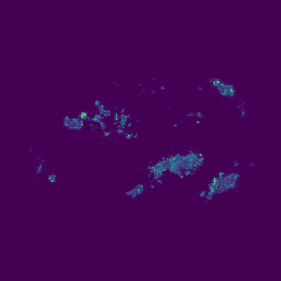 |
| **Where it hesitates** — the gap between the 25 % and 75 % lines | **Two copies, compared** — same data, different random start |

---

## 7. 60 pictures: honest, and not enough

The model gives every pixel a number between 0 and 1 — how sure it is. To draw an outline
you have to pick a **cut-off**.

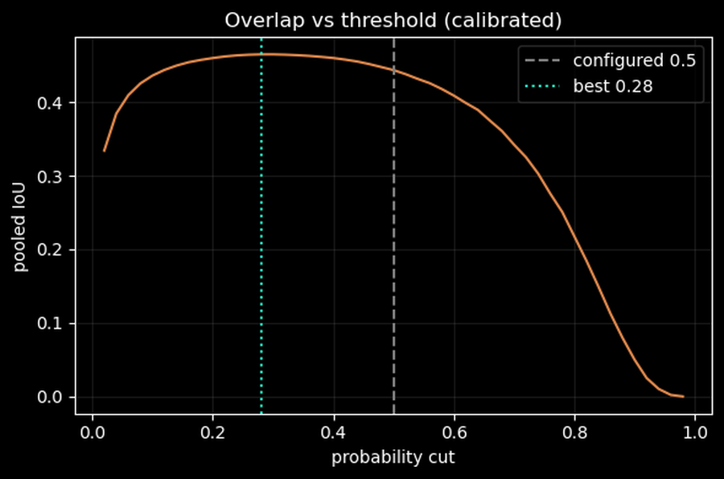

0.5 is the obvious choice and it is not the best one: here **0.28** scores higher, because
the model is systematically shy. Each point on that curve is the score you would get by
drawing the line at that confidence.

| | overlap |
|---|---|
| at the default cut-off of 0.5 | 0.437 |
| at the best cut-off (0.28) | **0.465** |
| gap between two training runs | 0.025 |

Both runs were at their best after the **first pass** of ten, then slowly got worse: at this
size the model memorises its 60 pictures. The fix is more **pictures**, not more passes.

---

## 8. Does it mean what it says?

When the model says a pixel is **70 % likely** to be active region, is it right about 70 %
of the time? Out of the box, no — it was over-confident.

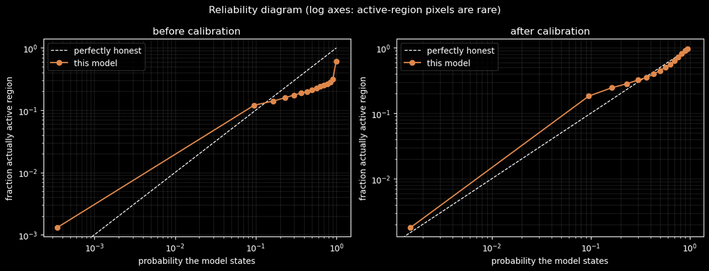

One scale-and-shift correction, fitted on a random half of the test pictures and checked on
the other half, closes the gap between what it says and what happens:

| stated-vs-observed gap | value |
|---|---|
| before | 0.0098 |
| after | **0.0015** |

**Why it matters.** A calibrated number is one you can act on. *"Watch this one"* means
something different at 70 % than at 30 % — but only if 70 % really is 70 %.

---

## 9. How good is "good enough"? The label floor

The answer key is not handed down by nature. It is a **recipe**: threshold the magnetic map
at ±50 gauss, throw away specks under 100 pixels, grow the edges a little, keep the blobs
that straddle a polarity dividing line. Every number in that recipe is a judgement call.

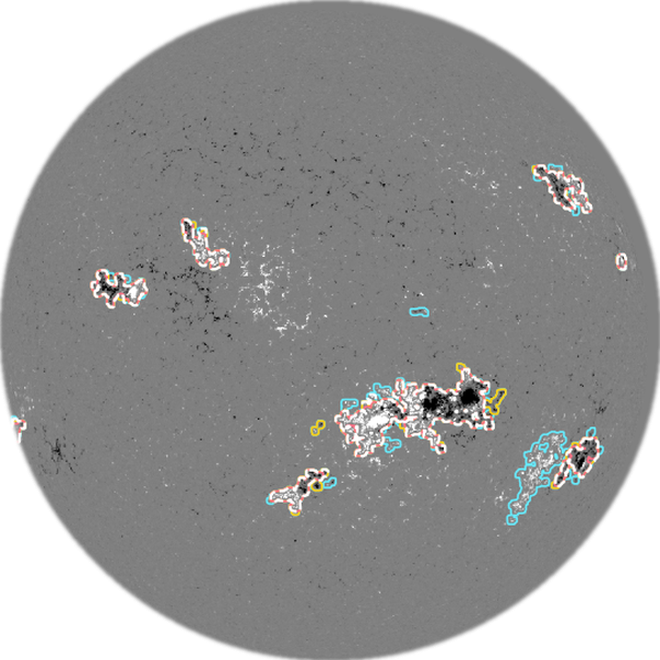

Rebuild the key at **±40 G**, then again at **±60 G**. Both are perfectly defensible. On
this run's own pictures the two keys agree with *each other* at an overlap of **0.628**.

That is the **label floor**: below it you are measuring the model; at it, you are measuring
the key's own indecision.

```
 0 ─────────────── 0.437 ──────────── 0.628 ══════════════ 1.0
 no overlap        60 pictures        ↑ floor              identical
                                      the 400-picture model lands here too
```

The floor is measured from the same validation images the model is scored on, so this is a
like-for-like comparison rather than a borrowed constant.

---

## 10. Near the edge, everything shrinks

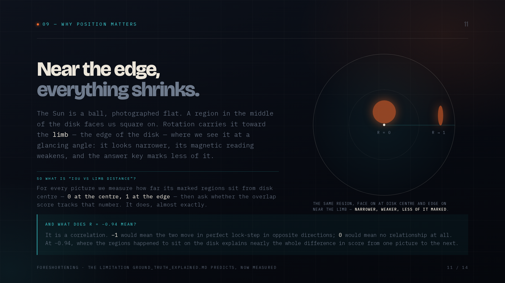

The Sun is a ball, photographed flat. A region in the middle of the disk faces us square on.
Rotation carries it toward the **limb** — the edge of the disk — where we see it at a
glancing angle: it looks narrower, its magnetic reading weakens, and the answer key marks
less of it.

**So what is "IoU vs limb distance"?** For every picture we measure how far its marked
regions sit from disk centre — **0 at the centre, 1 at the edge** — then ask whether the
overlap score tracks that number. It does, almost exactly.

**And what does r = −0.94 mean?** It is a correlation. **−1** would mean the two move in
perfect lock-step in opposite directions; **0** would mean no relationship at all. At −0.94,
where the regions happened to sit on the disk explains nearly the whole difference in score
from one picture to the next.

---

## 11. The Sun turned. The score fell with it.

The three test days run back to back, and the same regions drift toward the edge.

| day | overlap | r (0 = centre, 1 = limb) |
|---|---|---|
| 16 Jan 2013 | 0.491 | 0.45 |
| 17 Jan 2013 | 0.411 | 0.53 |
| 18 Jan 2013 | 0.360 | 0.60 |

| what tracks the score | r |
|---|---|
| distance from disk centre | **−0.94** |
| how much area is marked | +0.90 |
| agreement between our rule and the published key | −0.19 |

Their marked area shrinks by a third; the score falls with it. Our rule and the published
key agreed just as well on day 3 as on day 1 — so this is the Sun turning, not a bug.
Distance and area are two views of one thing: **foreshortening**.

---

## 12. 400 pictures: thirteen passes, then stop

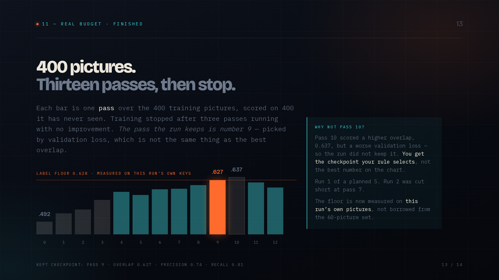

Each bar is one pass over the 400 training pictures, scored on 400 it has never seen.
Training stopped after three passes running with no improvement.

**The pass the run keeps is number 9** — picked by validation loss, which is not the same
thing as the best overlap.

| kept checkpoint (pass 9) | |
|---|---|
| overlap | **0.627** |
| precision | 0.74 |
| recall | 0.81 |

**Why not pass 10?** Pass 10 scored a higher overlap, 0.637, but a worse validation loss —
so the run did not keep it. *You get the checkpoint your rule selects, not the best number
on the chart.*

Two things this curve establishes: 400 pictures are **not** memorised after ten passes (at
60 pictures the best pass was the second), and the **first pass alone** beat everything the
60-picture run ever managed — 0.492 against a best of 0.465.

This was run 1 of a planned 5. Run 2 was cut short at pass 7 and is not included.

---

## 13. Where it stands

**At 60 pictures, the model was the weak link. At 400, it is level with the answer key.**

At 60 training pictures the best score was **0.465**, far under the key's own wobble — the
model was clearly the weaker link. At 400 the kept checkpoint scores **0.627**, against a
floor of **0.628** measured on the same pictures. That is the same number, given the
model's own uncertainty of ±0.008.

That is not perfection. It means what is left of the disagreement is the size of the answer
key's own indecision — and that further gains on this particular score cannot be
distinguished from a different choice of threshold in the labelling recipe.

### What comes next

1. **Finish the ensemble** — two members give a run-to-run spread of **0.004** against a
   sampling uncertainty of **0.017**, so which random start you get barely matters at this
   size. That flips the 60-picture result, where the two were the same size. One run of five
   is done and the second was cut short at pass 7, so treat it as provisional.
2. **Spread the floor across the cycle** — the 60 images it uses all fall in January 2013,
   because the floor step takes the earliest slice of a time-ordered validation set.
3. **Score each region, not each pixel** — found or missed, where, how big. What a
   forecaster would actually use, and what the limb effect argues for.
4. **Widen the floor** — wobble the recipe's other two dials, not just the ±gauss threshold.

---

## A note on precision

The model's kept checkpoint and the label floor both land on 0.627-0.628. Those are two
different quantities that happen to coincide, not one number quoted twice: the first is how
well the model matches the answer key, the second is how well two versions of the answer key
match each other. The gap between them is far smaller than the ±0.008 uncertainty on the
model's own score, which is the honest reason to call them level rather than to rank them.

The floor itself carries one caveat worth repeating: it is measured on 60 validation images
that all fall in January 2013, so it is this run's own data but not yet a 2013-2015 floor.

## Provenance

| artefact | location |
|---|---|
| the talk | `ws2_project_docs/ar_segmentation_magnetogram.{html,pdf,pptx}` |
| technical report | `ws2_project_docs/RESULTS_REPORT.md` |
| notebooks, explained | `NOTEBOOKS_EXPLAINED.md`, `ERRORS_NOTEBOOK_EXPLAINED.md`, `GROUND_TRUTH_EXPLAINED.md` |
| per-pass training metrics | `runs/errors_surya_seed{0,1}_real_window-stratified_pw9_bce-dice_lr0.0001_es3_best/version_0/metrics.csv` |
| error analysis, real budget | `runs/nbconvert/3_errors_real_analysis.ipynb` |
| answer key | Roy *et al.* 2026, DOI 10.1038/s41597-026-06552-5 |
| model | `nasa-impact/surya` (366 M parameters) |
